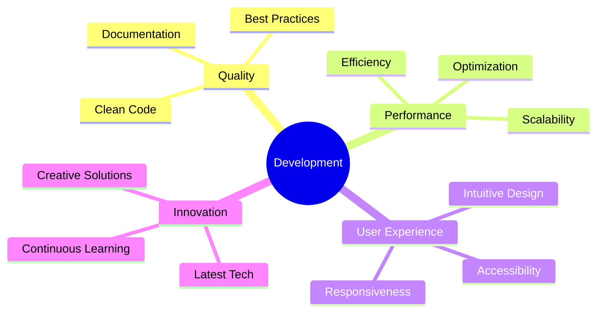

<div align="center">

# 👋 Assalamu Alaikum! I'm Md Mehedi Hasan


<br/>

[](https://github.com/MehediHasanSumon)
[](https://github.com/MehediHasanSumon)
[](https://github.com/MehediHasanSumon)

</div>

---


### 🌟 About Me

```yaml
name: Md Mehedi Hasan
role: Full-Stack Web Developer
location: Bangladesh 🇧🇩
education: Computer Science & Engineering
motto: "Clean Code, Scalable Solutions, Innovative Thinking"
current_focus: Building amazing web experiences
fun_fact: I debug with print statements and I'm not ashamed! 😄
```

> *"If you think you lost everything, then remember: **you haven't lost Allah!***"  
> — A quote that inspires me to stay resilient and keep moving forward.

<br clear="right"/>

---

## 🛠️ Tech Arsenal

<div align="center">

### 🎨 Frontend Technologies
<p>
  
</p>

### ⚙️ Backend & Database
<p>
  
</p>

### 🔧 Tools & Platforms
<p>
  
</p>

</div>

---

## 📊 GitHub Analytics

<div align="center">
  
  
</div>

<div align="center">
  
</div>

<div align="center">
  
</div>

---

## 🏆 GitHub Trophies

<div align="center">
  
</div>

---

## 🎓 Education & Featured Projects

<table align="center">
<tr>
<td width="50%" valign="top">

### 🎯 Education
**Bachelor of Science**  
*Computer Science and Engineering*  
📍 BGIFT Institute of Science & Technology

### 🌟 Core Competencies
- 🔥 Full-Stack Development
- 🎨 UI/UX Design Implementation  
- 📊 Database Architecture
- 🚀 Performance Optimization
- 🔐 Security Best Practices

</td>
<td width="50%" valign="top">

### 🚀 Featured Projects

**🍽️ Restaurant Management System**
- Full-stack application with authentication
- Order management & reporting system
- Real-time updates & notifications

**🏫 School Management System**  
- Comprehensive academic management
- Student, teacher & attendance tracking
- Examination & grading system

**💼 Portfolio Website**
- Modern responsive design
- Interactive animations
- Performance optimized

</td>
</tr>
</table>

---

## 📈 Development Activity

<!--START_SECTION:waka-->
```text
JavaScript   12 hrs 30 mins  ████████████░░░░░░░░░  60.5%
TypeScript   4 hrs 15 mins   ████░░░░░░░░░░░░░░░░░  20.8%
React        2 hrs 45 mins   ██░░░░░░░░░░░░░░░░░░░  13.4%
CSS          1 hr 10 mins    ░░░░░░░░░░░░░░░░░░░░░   5.3%
```
<!--END_SECTION:waka-->

<div align="center">

### 💻 Weekly Development Breakdown


</div>

---

## 🌟 My Development Philosophy

<div align="center">



</div>

---

## 🤝 Let's Connect & Collaborate

<div align="center">
  
### 🌐 Find me around the web:

[](https://github.com/MehediHasanSumon)
[](https://linkedin.com/in/yourprofile)
[](mailto:your.email@example.com)
[](https://your-portfolio.com)
[](https://twitter.com/yourhandle)

### 💬 Open for:
- 🚀 Collaboration on exciting projects
- 💼 Freelance opportunities  
- 🎯 Full-time positions
- 🤝 Open source contributions
- 💡 Innovative ideas discussion

</div>

---

<div align="center">

### 🎵 Currently Vibing To:
[](https://open.spotify.com/user/yourusername)

### ☕ Support My Work:
[](https://buymeacoffee.com/yourhandle)

---


---

### 🔥 Final Thoughts

```javascript
class Developer {
  constructor() {
    this.name = "Md Mehedi Hasan";
    this.skills = ["JavaScript", "React", "Node.js", "Python"];
    this.motto = "Code with passion, debug with patience!";
  }
  
  sayHi() {
    console.log("Thanks for visiting my profile! Let's build something amazing together! 🚀");
  }
}

const me = new Developer();
me.sayHi();
```

**May your code be bug-free and your coffee strong! ☕️✨**

</div>

---

<div align="center">
  
</div>
